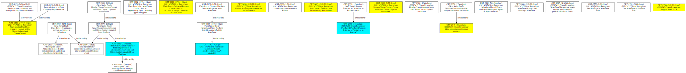
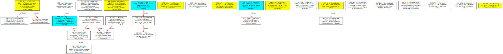

TopScrum specific fork of jira-dependency-graph
====================
This fork was created with TopScrum specific fields and link types in mind, so that it's easy to spot blocking relationships between tickets. For general non-TopScrum specific, check out the original at https://github.com/pawelrychlik/jira-dependency-graph

Requirements:
=============
* [Python 3+](https://www.python.org/downloads/)
* [Graphviz](https://graphviz.org/)

Usage:
======
```bash
$ git clone https://github.com/teonimesic/jira-dependency-graph.git
$ cd jira-dependency-graph
$ pip install -r requirements.txt
```

Then add the following to your .bashrc | .zshrc (replacing password with your user api token or password):
```
jira_email=""
jira_password=""
jira_dependency_graph_path="/path/to/jira-dependency-graph/jira-dependency-graph.py"
jira_url=""

jira-issue-blockers() {
    python $jira_dependency_graph_path --ignore-closed --user=$jira_email --password=$jira_password --jira=$jira_url -x "relates to" -x clones -x "is cloned by" -x "is blocked by" -x "is child of Initiative" -w -T --local "$1" | dot -Tsvg > issue_blockers.svg
}

jira-jql-blockers() {
    python $jira_dependency_graph_path --ignore-closed --user=$jira_email --password=$jira_password --jira=$jira_url -x "relates to" -x clones -x "is cloned by" -x "is blocked by" -x "is child of Initiative" -w -T --local --jql "$1" | dot -Tsvg > blockers.svg
}

jira-epic-blockers() {
    python $jira_dependency_graph_path --ignore-closed --user=$jira_email --password=$jira_password --jira=$jira_url -x "relates to" -x clones -x "is cloned by" -x "is blocked by" -x "is child of Initiative" -w -T --local --jql "'Epic Link'=$1" | dot -Tsvg > epic-blockers.svg
}

jira-sprint-blocked() {
    python $jira_dependency_graph_path --ignore-closed --user=$jira_email --password=$jira_password --jira=$jira_url -x "relates to" -x clones -x "is cloned by" -x "blocks" -x "is child of Initiative" -w -T --local --jql "sprint=$1" | dot -Tsvg > sprint-blocked.svg
}

jira-sprint-blockers() {
    python $jira_dependency_graph_path --ignore-closed --user=$jira_email --password=$jira_password --jira=$jira_url -x "relates to" -x clones -x "is cloned by" -x "is blocked by" -x "is child of Initiative" -w -T --local --jql "sprint=$1" | dot -Tsvg > sprint-blockers.svg
}
```

And then use it like:
```
jira-issue-blockers CRT-3116
jira-jql-blockers 'fixVersion="Starfleet Contacts"'
jira-epic-blockers CRT-2934
jira-sprint-blocked 2209
jira-sprint-blockers 2209
```

The reason why there are sprint-blocked and sprint-blockers, is that the first one helps you to find issues that you may be missing in your sprint and need to add them (by travesing blocked by until you find all tickets that you require), while the second helps you increase priority for tickets that have many dependencies or avoid adding them to the sprint.

Sprint Blocked:


Sprint Blockers:


Lessons Learnt:
===============

Don't use Google's Graphviz, and instead install your own (by adding --local and sending the result to be parsed by `dot` as SVG). Either because of timeout or some other reason, it does not work well for more complex graphs. Also, I recommend usage of -T to avoid traversing to other projects such as PI (Portfolio Initiative), which will in turn go to every project you can imagine and download ALL tickets in existance. -w makes it a lot nicer to read the summary, and --ignore-closed omits traversing to Done tickets (very useful if you want to use this for checking blockers/blocked).

Finally, while you can fetch all tickets of an epic by using jira-issue-blockers with the epic jira key, this will add the Epic as the root and make everything be connected with it, which looks bad, so I prefer to use jira-epic-blockers which simply fetches all tickets that belong to the epic directly.

Advanced Usage if you want to use/customize your own bash functions:
===============

List of all configuration options with descriptions:

```
python jira-dependency-graph.py --help
```

### Excluding Links

In case you have specific issue links you don't want to see in your graph, you can exclude them:

```bash
$ python jira-dependency-graph.py --user=your-jira-username --password=your-jira-password --jira=url-of-your-jira-site --exclude-link 'is required by' --exclude-link 'duplicates' issue-key
```

The grapher will still walk the link, just exclude the edge. This especially useful for bidirectional links and you only
want to see one of them, e.g. *depends on* and *is required by*.

### Excluding Epics

In case you want to exclude walking into issues of an Epic, you can ignore them:

```bash
$ python jira-dependency-graph.py --user=your-jira-username --password=your-jira-password --jira=url-of-your-jira-site --ignore-epic issue-key
```

### Including Issues

In order to only specify issues with a certain prefix pass in `--issue-include <XXX>` and all tickets will be checked that they match the prefix `XXX`.

### Excluding Issues

By passing in `--issue-exclude`, or `-xi` the system will explicitly ignore the ticket. It can be repeated multiple times, e.g. `-xi MYPR-456 -x MYPR-999` to ignore both issues. 
Use it as a last-resort only, when other means of exclusion do not suit your case, e.g. to omit a part of the graph for better readability.

### Authentication

It is possible to either use the username/password combination or to login via the browser passing in `--cookie <JSESSIONID>`. This logins via the browser and is useful in scenarios where Kerberos authentication is required.

If you are using Atlassian Cloud, use your API token instead of your account password. You can generate one with the following steps:

1. Access https://id.atlassian.com/manage-profile/security/api-tokens.
2. Click "Create API token".
3. Copy the token and store it in a safe place.

More details about API authentication is available in the [official documentation](https://developer.atlassian.com/cloud/jira/platform/basic-auth-for-rest-apis/).

### Closed Issues

By passing in `--ignore-closed` the system will ignore any ticket that is closed.

### Multiple Issues

Multiple issue-keys can be passed in via space separated format e.g.
```bash
$ python jira-dependency-graph.py --cookie <JSESSIONID> issue-key1 issue-key2
```

### JQL Query

Instead of passing issue-keys, a Jira Query Language command can be passed with `--jql` e.g.
```bash
$ python jira-dependency-graph.py --cookie <JSESSIONID> --jql 'project = JRADEV'
```


Usage without Google Graphviz API:
============
If you have issues with the Google Graphviz API limitations you can use your local graphviz installation like this:

```bash
$ git clone https://github.com/pawelrychlik/jira-dependency-graph.git
$ cd jira-dependency-graph
$ python jira-dependency-graph.py --user=your-jira-username --password=your-jira-password --jira=url-of-your-jira-site --local issue-key | dot -Tpng > issue_graph.png
```

*Note*: Its possible that the graph produced is too wide if you have a number of issues. In this case, it is better to firstly pipe the graph to a 'dot' text file e.g.

```bash
$ python jira-dependency-graph.py --jira=url-of-your-jira-site --local issue-key > graph.dot
```

and then process it using `unflatten`:

```bash
unflatten -f -l 4 -c 16 graph.dot  | dot | gvpack -array_t6 | neato -s -n2 -Tpng -o graph.png
```

For a slightly cleaner layout (that preserves the ranks), or if your system doesn't have `unflatten`, you can use `sed` to insert `rankdir=LR;` into the dot file before processing it:
```bash
sed -i 's/digraph{/digraph{ rankdir=LR;/g' graph.dot | dot -o graph.png -Tpng
```

Notes:
======
Based on: [draw-chart.py](https://developer.atlassian.com/download/attachments/4227078/draw-chart.py) and [Atlassian JIRA development documentation](https://developer.atlassian.com/display/JIRADEV/JIRA+REST+API+Version+2+Tutorial#JIRARESTAPIVersion2Tutorial-Example#1:GraphingImageLinks), which seemingly was no longer compatible with JIRA REST API Version 2.
